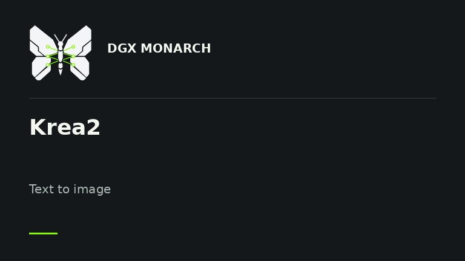
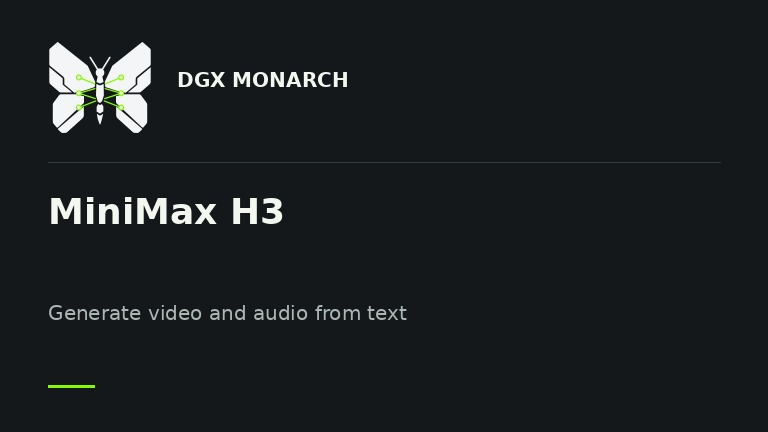
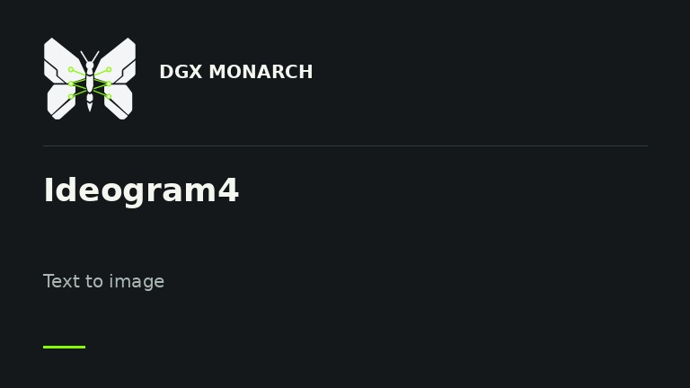
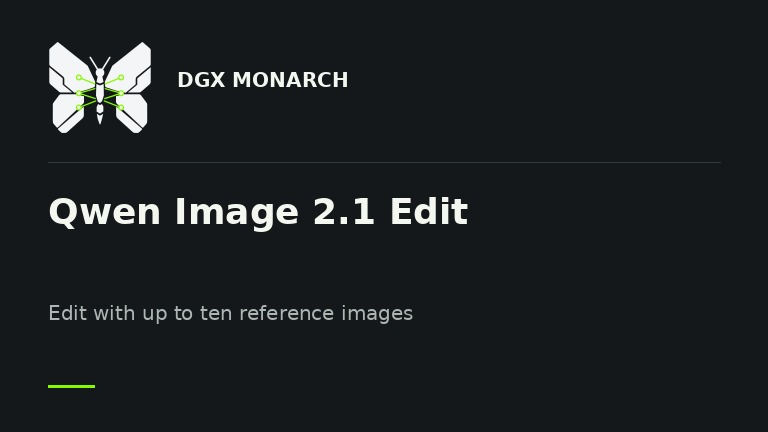
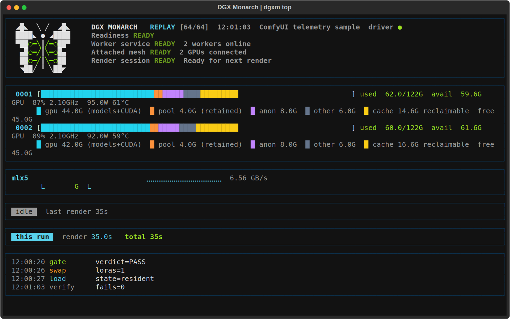

<picture>
  <source media="(prefers-color-scheme: dark)" srcset="docs/media/monarch-wordmark-dark.svg">
  
</picture>

# Use both Sparks in ComfyUI

[](https://github.com/Balaxxe/dgx-monarch/actions/workflows/ci.yml)
[](https://github.com/Balaxxe/dgx-monarch/actions/workflows/comfy-canary.yml)
[](LICENSE)

Generate images and video across two DGX Sparks from one ComfyUI window. Split a render between the GPUs, run separate prompts at once, or shard supported model weights to fit larger checkpoints.

DGX Monarch provides model loaders, samplers, memory controls, and 58 example workflows. Text encoding, VAE decode, saving, and the rest of your graph stay in ComfyUI.

[Get started](docs/QUICKSTART.md) · [Installation](docs/INSTALL.md) · [Model support](docs/MODELS.md) · [Benchmarks](docs/BENCHMARKS.md)

<a id="what-this-is"></a>

## Why use it?

- **Wait less for a render.** Distribute one supported image or video job across the pair. The results below compare the same graph on one GPU and two.
- **Work on two prompts at once.** Fleet runs a separate render on each GPU, useful for trying prompts or processing independent jobs.
- **Fit larger models.** FSDP divides supported model weights between the GPUs. It is a capacity option and can be slower; text encoders, VAEs, and other driver work still need local memory.
- **Avoid unnecessary model copies.** Slab residency and low-RSS LoRA handling reduce duplicate weights in shared memory. Built-in checks compare these paths with stock residency before reuse.
- **Start with a model workflow.** Choose a template, select your files, and queue it. Automatic selection chooses a supported GPU layout for the model; the model guide explains the manual options.
- **See what the pair is doing.** The ComfyUI sidebar and `dgxm top` show memory use, render progress, connection state, and errors.

## Featured workflows

<table>
<tr>
<td width="50%" valign="top">
<a href="example_workflows/dgx-monarch-krea2-t2i.json"></a><br>
<strong>Krea2 RAW and Turbo</strong><br>
Image generation, with LoRA support and several ways to split work across the pair.
</td>
<td width="50%" valign="top">
<a href="example_workflows/dgx-monarch-minimax-h3-t2va.json"></a><br>
<strong>MiniMax H3</strong><br>
Video with audio, plus image-guide and reference-video workflows.
</td>
</tr>
<tr>
<td width="50%" valign="top">
<a href="example_workflows/dgx-monarch-ideogram4-t2i.json"></a><br>
<strong>Ideogram4</strong><br>
Image generation with support for its two-model workflow.
</td>
<td width="50%" valign="top">
<a href="example_workflows/dgx-monarch-qwen-image21-edit-rgba.json"></a><br>
<strong>Qwen Image 2.1</strong><br>
Image generation and editing with up to ten references, including alpha-masked images.
</td>
</tr>
</table>

The pack also includes Flux, Chroma, LTX, Hunyuan, Wan, and other families. [Model support](docs/MODELS.md) lists the tested configurations and limits for each. Support for one workflow does not mean every precision, LoRA, or parallel mode has been tested.

<a id="what-we-measured"></a>

## Measured results

Recorded renders on two DGX Sparks connected over ConnectX-7 200G:

| Workflow | One GPU | Two GPUs | Speedup |
|---|---:|---:|---:|
| Krea2 RAW BF16, 1536×1536, 8 steps, CFG++ sampler, Ulysses | 74.1 s | 48.1 s | 1.54× |
| Ideogram4 FP8, dual-model, 1024×1024, 20 steps, Ulysses | 36.0 s | 26.0 s | 1.38× |
| MiniMax H3 INT8 ConvRot, 1280×720, 241 frames, 20 steps, Ulysses | 42m 03s | 23m 07s | 1.82× |

Krea2 and Ideogram4 timings are warm renders of matching graphs. Their separate one-step output checks matched one GPU; those checks do not prove equality at every step of a full render. H3 uses exact attention: the one-GPU timing is stock ComfyUI, while one Monarch worker took 42m 20s and matched the pair's output. Results depend on the settings and hardware; [benchmark details](docs/BENCHMARKS.md#selected-results) describe each comparison.

**Qwen Image 2.1:** 12 model formats matched native ComfyUI output in one-step tests. Separate full 25-step generation and editing tests also matched, including ten-reference editing. A comparable speed measurement has not been recorded. [Qwen test results](docs/VALIDATION.md#evidence-qwen-image-2-1).

[Full benchmarks](docs/BENCHMARKS.md) include slower configurations. [Validation](docs/VALIDATION.md) explains output comparisons and remaining gaps. [Campaign results](docs/CAMPAIGN_RESULTS.md) provide the detailed measurements.

## Watch the pair

Run `dgxm top` to see memory use, render progress, GPU activity, and connection status in your terminal. The ComfyUI sidebar shows the same cluster while you work on a graph.

[](docs/TUI.md)

Dashboard shown with sample data. See the [TUI guide](docs/TUI.md) for setup, keyboard controls, and recording.

## Set up with a coding agent

Use an agent with a shell on the driver Spark, approved SSH access to the other
Spark, and access to the selected ComfyUI and model directories. It needs
network access for source and dependency downloads. A browser-only agent cannot
complete the hardware steps without a connection to those machines. You may
need to approve maintenance or complete sudo, SSH trust, repository access, or
model-license steps yourself. Never paste private keys or tokens into chat.

Copy this prompt into your agent:

```text
Help me install DGX Monarch from https://github.com/Balaxxe/dgx-monarch on my two DGX Sparks. Use the checkout I provide, or clone the repository if needed. Explicitly read skills/dgx-monarch/SKILL.md and follow it and its linked docs; do not assume skills are discovered automatically.

Discover what you can safely and ask only for missing inputs or approvals. Show the installation and rollback plan before making changes. Preserve existing environments, models, credentials and unrelated work. Ask before disruptive, destructive, or security changes, and never print credentials.

Complete the documented first distributed render, save its output, and show that both Sparks participated. Check that rerunning setup preserves the installation. Report the commit, versions, reused components, manual steps, results and limitations. Do not claim success from imports or Doctor alone.
```

The maintained setup procedure is [skills/dgx-monarch/SKILL.md](skills/dgx-monarch/SKILL.md).
Review the agent's plan before it changes your machines. See the
[fresh-agent installation results](docs/VALIDATION.md#fresh-agent-installation)
for the tested setup and its limits.

## Get started

You need an existing ComfyUI installation. For the tested two-Spark setup, both hosts need matching software and model files, plus an isolated, source-restricted fabric connection. Read the [fabric requirements](SECURITY.md#fabric-trust-boundary) before setup: the attach API has no peer authentication, and restricting the Worker port alone is insufficient.

1. Follow [INSTALL](docs/INSTALL.md) using the Python that starts ComfyUI. Keep its CUDA torch build and install this checkout under `custom_nodes`.
2. Configure the pair with [guided setup](docs/INSTALL.md#guided-multi-node-setup), then check `dgxm doctor` and `dgxm status`.
3. Keep ComfyUI in a foreground terminal. Open **Workflow → Browse Templates → dgx-monarch**, open the [recommended Chroma workflow](docs/QUICKSTART.md#first-distributed-render), and select its verified model files.
4. Queue the graph. See [QUICKSTART](docs/QUICKSTART.md) for the node layout and first-run checks.

Worker services stay running when ComfyUI closes. Use `dgxm down` when you intend to stop them.

One Spark also works: Init `mode=auto` without `cluster.toml` stays local. The memory tools, templates, sidebar, and diagnostics remain available.

## Before the first render

With the default `auto_gate=first_use`, a new combination using slab and low-RSS or FSDP may run reference renders before producing your result. Allow **2-4 minutes** on the tested hardware. A successful check is reused for the same combination; an upgrade requires new checks before those results can be reused.

If the comparison fails, supported resident paths use stock residency with the memory optimizations disabled. FSDP has no stock fallback and refuses. Some large FSDP checkpoints cannot fit the gate's reload; [the model guide](docs/MODELS.md) and [troubleshooting](docs/TROUBLESHOOTING.md) explain the available choices.

Native latent RDMA is **off by default** and remains **NOT RUN / HOLD**. Latents return through actor messages; this does not disable NCCL rendering across the pair. [`comfy_managed` residency](docs/TROUBLESHOOTING.md#62-comfy-managed-residency-what-the-comfy_managed-widget-does-and-everything-it-refuses) is opt-in and has additional memory and LoRA restrictions. Smaller jobs may gain little from using two GPUs.

## Documentation

[Documentation index](docs/README.md) · [Model guide](docs/MODELS.md) · [Troubleshooting](docs/TROUBLESHOOTING.md) · [FAQ](docs/FAQ.md) · [Contributing](CONTRIBUTING.md)

DGX Monarch uses [PyTorch Monarch](https://github.com/meta-pytorch/monarch) for actors and [xDiT / xfuser](https://github.com/xdit-project/xDiT) for parallel attention, inside [ComfyUI](https://github.com/comfyanonymous/ComfyUI). These dependencies are installed separately; this repository does not vendor their code.

License: [Apache-2.0](LICENSE).
