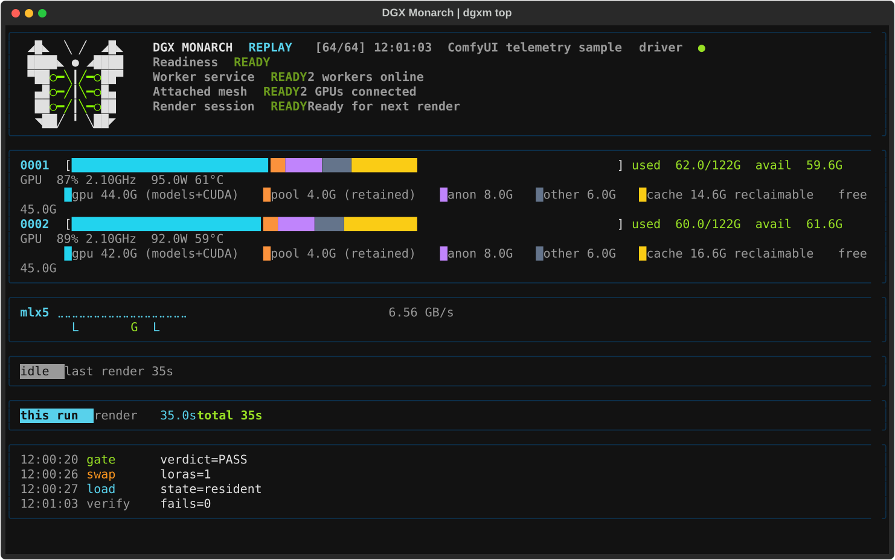

# dgxm top: live cluster dashboard

Terminology is defined in [CONCEPTS.md](CONCEPTS.md).

```
dgxm top                      # live dashboard; finds every local ComfyUI that
                              # has this node pack and prefers one with a live
                              # mesh (:8188 and :8191 are checked even when
                              # process discovery is unavailable)
dgxm top --host 127.0.0.1:8189   # skip discovery and use this driver
dgxm top --record run.jsonl   # also append every tick to a file
dgxm top --replay run.jsonl   # scrub a recording instead of live data
dgxm top --theme ember        # spark (default) | ember | mono
dgxm top --interval 0.5       # poll every half-second (allowed: 0.1..3600)
dgxm --config PATH top        # label Worker services from another cluster.toml
```

`--config` is a global `dgxm` option, so it comes before `top`. The file
supplies the Worker service endpoints the dashboard labels.
The poll interval defaults to one second. Its bounds, 0.1 and 3600 seconds,
limit the one-hour history to 36,000 samples and keep timer values valid;
`dgxm top` rejects a value outside them before it starts.

`dgxm top` needs the optional `[tui]` extra, installed with the same
interpreter that starts ComfyUI. Installation commands and update behavior are
in [INSTALL.md](INSTALL.md#install-from-source).



Illustrative dashboard using sample data, not a benchmark result.

## What it shows

* **Per-box unified-memory bar:** gpu (models+CUDA), slab (model, zero-copy),
  retained pool, anon and other are five segments that never overlap and sum
  exactly to used memory (`MemTotal - MemAvailable`). Reclaimable cache and free
  split `MemAvailable`, so the six colored segments plus the uncolored free
  remainder add up to `MemTotal`. GPU utilization, clock, power and temperature
  follow. The legend under the bar names each segment; `slab` appears only when
  a model is slab-resident. The default `spark` theme matches the ComfyUI sidebar: gpu cyan, slab green,
  pool orange, anon purple, other grey, and cache yellow. `ember` and `mono`
  recolor all six. No segment uses one of the sixteen standard ANSI
  colors, so a terminal palette change cannot merge two segments. `slab` and
  `pool` are residency terms; [CONCEPTS.md](CONCEPTS.md) defines both, and what
  reclaims the pool.
* **RDMA rails:** per-rail GB/s, with a braille history graph, for one box: the first
  host by name (the rails are symmetric, so one host represents the pair). The
  counters are `/sys/class/infiniband/*/ports/*/counters/port_{rcv,xmit}_data`.
  During a sequence-parallel render, the all-to-all traffic shows as one pulse
  per denoise step.
* **Render line:** live step progress (fed by the driver's own progress
  channel), s/it and ETA, or the last render's duration when idle, then the
  gate ledger's count of each verdict. The label names the active stage, such as
  `gate proof 2 of 2-4`, `cross-residency check`, or `render`.
* **Run summary:** a first-use request runs NCCL setup, loads the model, and
  performs the gate's reference and residency checks before rendering. The
  summary lists each stage, its duration, and the total until the
  next request.
* **Readiness:** the same health layers and advisory actions as CLI JSON and
  the browser panel use. [CONCEPTS.md](CONCEPTS.md#operator-words) holds the
  aggregation and observation rules.
* **low_rss state per box:** LoRA mode, unbake file-backed GiB and the
  ambient-verify failure count (red when nonzero).
* **Event ticker and markers:** swaps (with phase timings), loads, gate
  verdicts, and quarantines appear as events in the ticker and as a marker glyph
  (S, G, L, Q) under the rail graphs. First-render notices (NCCL bring-up, cold
  load, and identity-gate phases) stay in the ticker only, so they cannot
  overwrite a marker.

The ComfyUI memory sidebar draws a worker's card only after that worker's full
host-memory report arrives, so a worker still starting up never shows a card of
default values or hides valid driver telemetry. A driver on its own host keeps
its card beside the workers; on a worker's host, that worker's card replaces
the driver's.

## Butterfly header

The Monarch butterfly appears beside the status lines on terminals at least
100 columns wide. Smaller terminals keep the name and leave room for telemetry.
The wings appear over the first second without delaying polling or navigation.
A pulse moves along the green circuits only while a recent driver sample reports an active render;
idle, paused, and replay views stay still. Press `a` to turn animation off.

The mark uses green independently of the memory palette and status indicators.
The `mono` theme and `NO_COLOR` remove its color. Terminals with an incompatible
output encoding use an ASCII butterfly; `TERM=dumb` also disables its animation.

## Record and replay

Arrow keys scrub from `LIVE` (`←` auto-pauses; scrubbing `→` past the newest
tick resumes `LIVE`); `space` toggles pause. `s` saves the ring to a
timestamped JSONL file. `dgxm top --replay` reproduces the recorded dashboard
state. A recording is a full-fidelity private diagnostic, not a
disclosure-reduced receipt: it can contain host and network identity, worker
endpoints, model and render detail, events, and ledger summaries. Do not
attach it unreviewed to a public bug report. Redact it to the narrow evidence
needed, or use the private security-reporting path when disclosure is
sensitive. Recording writes require one owner-held, non-symlink regular file
with mode `0600`; an existing target that does not meet these requirements is
refused. The run block and render label follow the selected tick. The
dashboard retains the latest 4,096 events and refreshes existing entries when
the route resends them, without marking unchanged events as new.

A poll that began before a pause or scrub is discarded, even if the view is
back on `LIVE` when it returns; only a later live poll publishes. A malformed
response or a normalization failure records a fresh `UNKNOWN` tick instead of
leaving an older healthy tick on screen. If only the run story fails, its block
shows `run story unavailable (<exception type>)` and the other panels keep
redrawing.

## Keys

`q` quit · `space` pause/scrub · `←/→` scrub · `a` animations · `t` theme ·
`s` save recording · `l` gate ledger · `w` worker detail

## Data sources and isolation

The dashboard reads two sources without changing either: the driver's
`/dgxm/telemetry` HTTP route, which ComfyUI serves from the live mesh, and the
local host (sysfs, bounded `/proc` reads, and pynvml or nvidia-smi).
`dgxm top` never attaches a second Monarch client, opens a Monarch worker
socket, or runs SSH. Worker, mesh and readiness indicators use only what the
driver reports; without an exact report, including while the driver is down,
they show `?` (unknown), and local data keeps the rest of the dashboard
live. `dgxm status` gives the passive Worker service and Attached mesh facts,
and `dgxm status --json` adds readiness. `dgxm doctor` runs the full cluster
preflight; `dgxm doctor --json` adds readiness and keeps the same checks,
counts and exit codes. Doctor JSON is a full-fidelity diagnostic surface, not a
disclosure-reduced operator receipt: review and redact it before you share it.
[CONCEPTS.md](CONCEPTS.md#operator-words) gives each surface's observation
limits.

The retained-pool `/proc/*/smaps` scan has a 0.5-second total budget. An
incomplete scan keeps the last complete pool value instead of publishing a
partial total, so polling stays responsive with the driver down. Telemetry
event tails have a fixed schema and hold at most 256 entries; text and list
fields are bounded too, and non-finite JSON numbers become `null`. Worker
telemetry reports setup cleanup only as the boolean `setup_cleanup_failed`:
`true` blocks readiness, malformed evidence is `unknown`, and private setup
detail is excluded from telemetry.

A worker answers its 10 s status call on the same actor that runs the render,
so a refresh against saturated workers can time out. The route then serves its
last good snapshot and logs one INFO note per render. It warns instead when the
fleet is idle, when the failure is not a timeout, or when it has no good
snapshot to serve ([docs/TROUBLESHOOTING.md #58](TROUBLESHOOTING.md#58-worker-status-poll-timed-out-while-a-render-is-in-flight)).

`/dgxm/metrics` serves the numeric subset as Prometheus text exposition for
Grafana-compatible monitoring.

---
See [VALIDATION.md](VALIDATION.md) for hardware test results. Dashboard
illustrations use sample data.
